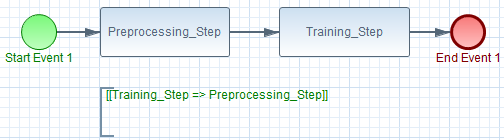

# FromMLWFConfigurationToBPMN


## Overview

The **ml2wf** project aims to help **Data Scientists** creating their workflows in the BPMN standard from a FeatureModel.

You can define your own constraints easily by commenting your workflow using a predefined and customizable syntax.

Once created and modified, the data scientist can merge the workflow into the FeatureModel and reuse it later. Furthermore, this will allow data scientists to use **Meta-learning** and over time to automate the workflows creation.

## Table of contents

- [Overview](#Overview)
- [Usage](#Usage)
  - [Command line](#Command line)
  - [Configuration](#Configuration)
- [Installation](#Installation)
  - [Prerequisites](#Prerequisites)
  - [Build](#Build)
  - [Run](Run)
- [Example](#Example)

## Usage

#### Command line

##### NAME

<pre>
ml2wf  Machine Learning problem to Workflow
</pre>
##### SYNOPSIS

<pre>
ml2wf -g -i <ins>file</ins> -o <ins>directory</ins> [-v]
ml2wf -m -i <ins>file</ins> -o <ins>file</ins> [-v]
</pre>
##### DESCRIPTION

<pre> 
-g, --generate    generate a workflow
-m, --merge       import a worklow in a FeatureModel
-i, --input       input file location
-o, --output      output file or directory location
-b, --backup      backup the original FeatureModel file before any modification
-v, --verbose     verbose mode
</pre>
#### Configuration

The default configuration is the following :

```
# constraints syntax (name : arity : symbol)

before : 2 : >>
after : 2 : <<

imp : 2 : =>
equ : 2 : <=>

conj : 2 : &
disj : 2 : |

not : 1 : !
```

**Note** that you can change this configuration modifying the `configuration.cfg` under the `ml2wf/config` directory

## Installation

#### Prerequisites

[JDK 11](https://www.oracle.com/java/technologies/javase-jdk11-downloads.html)

[Maven](https://maven.apache.org/)

#### Build

```bash
cd ml2wf
mvn clean package
```

The generated `.jar` is located in the `target` directory.

#### Run

```bash
cd target
java -jar ml2wf.jar [command] [arguments]
```


## Example

Lets consider this generic workflow :



#### Step 1 : Instantiation & Modification

We instantiate our generic workflow using the **generate** (-g) command and we change the tasks names which give us :


*Note that we put some constraints on our tasks (in comments).*

#### Step 2 : Merging

We now merge our instantiated workflow in the FeatureModel using the **merge** (-m) command.

Here is the result :


#### Step 3  : Reusing your generated tasks for other workflows

Using the FeatureModelIDE, you now can select the wished tasks and it will automatically select the needed ones.


