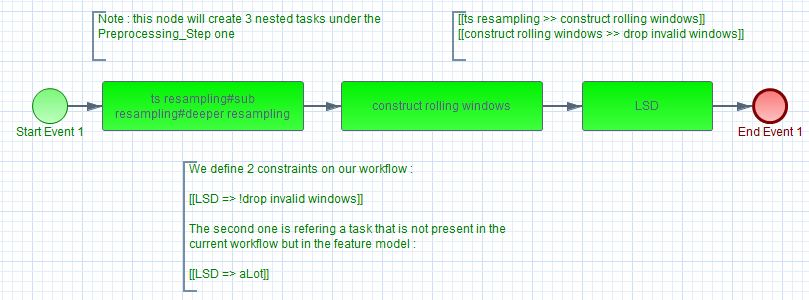
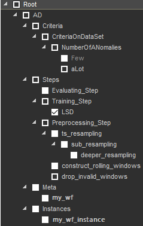

# FromMLWFConfigurationToBPMN


## Overview

The **ml2wf** project aims to help **Data Scientists** creating their workflows in the BPMN standard from a FeatureModel.

You can define your own constraints easily by commenting your workflow using a predefined and customizable syntax.

Once created and modified, the data scientist can merge the workflow into the FeatureModel and reuse it later. Furthermore, this will allow data scientists to use **Meta-learning** and over time to automate the workflows creation.

## Table of contents

- [Overview](#Overview)
- [Usage](#Usage)
  - [Command line](#command-line)
  - [Configuration](#Configuration)
- [Installation](#Installation)
  - [Prerequisites](#Prerequisites)
  - [Build](#Build)
  - [Run](#Run)
- [Example](#Example)

## Usage

#### Command line

##### NAME

<pre>
ml2wf  Machine Learning problem to Workflow
</pre>
##### SYNOPSIS

<pre>ml2wf generate -i <ins>file</ins> -o <ins>directory</ins> [-v level]
ml2wf build -f <ins>FeatureModel</ins> -m <ins>metaDirectory</ins> -i <ins>instanceDirectory</ins> [-b] [-v level]
ml2wf merge [--meta|--instance] -i <ins>file</ins> -o <ins>FeatureModel</ins> [-fb] [-v level]
ml2wf save -i <ins>meta</ins> <ins>instance</ins> -o <ins>FeatureModel</ins> [-b] [-v level]</pre>

##### DESCRIPTION

###### Commands

<pre>generate  generate a workflow
build     build a FeatureModel from a set of workflows
merge     import a worklow in a FeatureModel
save      save a meta-workflow and its instance in a FeatureModel</pre>

###### Arguments

<pre>-i, --input       input path
-o, --output      output path
-b, --backup      backup the original FeatureModel file before any modification
-f, --full		  process a full merge (including meta/instance relationship)
-v, --verbose     verbose mode (0=OFF,1=FATAL,2=ERROR,3=WARN,4=INFO,5=DEBUG,6=TRACE,7=ALL)</pre>


#### Configuration

The default configuration is the following :

```
# constraints syntax (name : arity : symbol)

before : 2 : >>
after : 2 : <<

imp : 2 : =>
equ : 2 : <=>

conj : 2 : &
disj : 2 : |

not : 1 : !
```

**Note** that you can change this configuration modifying the `configuration.cfg` under the `ml2wf/config` directory

## Installation

#### Prerequisites

[JDK 11](https://www.oracle.com/java/technologies/javase-jdk11-downloads.html)

[Maven](https://maven.apache.org/)

#### Build

```bash
cd ml2wf
mvn clean package
```

The generated `.jar` is located in the `target` directory.

#### Run

```bash
cd target
java -jar ml2wf.jar [command] [arguments]
```


## Example

Lets consider this generic workflow : **my_wf.bpmn2** :


and this initial feature model : **featureModel.xml** :


#### Step 1 : Instantiation & Modification

We instantiate our generic workflow using the **generate** command :

```bash
java -jar ml2wf.jar generate -i my_wf.bpmn2 -o result/
```

> *Note that the resulting instance will be located in the `result` directory with the name `my_wf_instance.bpmn2`.*

We change the tasks names which give us :



> *Note that we put some constraints on our tasks (in comments).*

**=> We now have 3 possibilities to create our knowledge database (*FeatureModel*).**

#### Step 2-A : Merging

We can merge our workflows in the *FeatureModel* using the **merge** command :

```bash
java -jar ml2wf.jar merge --meta -f -i my_wf.bpmn2 -o featureModel.xml
java -jar ml2wf.jar merge --instance -f -i result/my_wf_instance.bpmn2 -o featureModel.xml
```

> *Note that the -f argument will merge the meta/instance relationship*

#### Step 2-B : Saving

We can save the meta and instance relationship in the *FeatureModel* using the **save** command :

```bash
java -jar ml2wf.jar save -i my_wf.bpmn2 result/my_wf_instance -o featureModel.xml
```

#### Step 2-C : Building

We can build the *FeatureModel* using our existing workflows and the **build **command :

```bash
java -jar ml2wf.jar build -f featureModel.xml -m my_wf.bpmn2 -i result/
```

> *Note that the -m/-i argument can be a directory. In that case, all workflows in the given directory will be merged in the FeatureModel*.

**=> Here is the result :**


> *Note that the workflows' constraints are translated into FeatureModel constraints in order to keep our knowledge database consistency.*

#### Step 3  : Reusing your generated tasks for other workflows

Using the [*FeatureIDE*](https://featureide.github.io/), you now can select the wished tasks and it will automatically select the needed ones.


